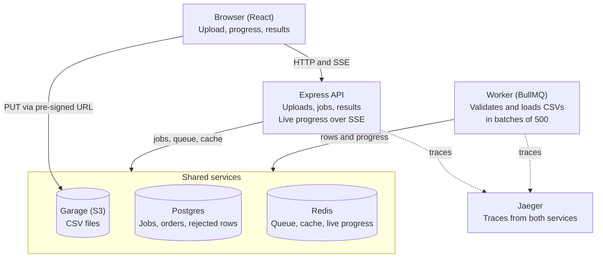
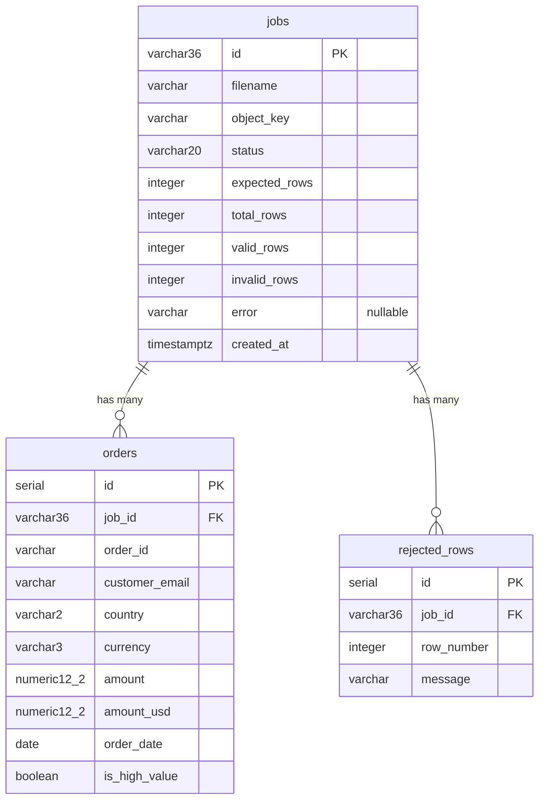

# Migrating the CSV Pipeline Backend: FastAPI to Node.js (Express)

## Overview

Port the Python backend to Node.js (Express, TypeScript) so the React frontend keeps working untouched: same URLs, same JSON, same behaviour. The system lets a user upload an order CSV straight to object storage; a background worker validates it, loads the valid rows into Postgres and reports progress live; the UI then shows totals and a paged order table.

- **Stays as it is:** the React frontend, Postgres (same database and tables), Redis, Garage (S3-compatible storage), Jaeger, Docker Compose, and the HTTP API contract.
- **Gets replaced:** the FastAPI app, the RQ worker, SQLAlchemy and Alembic, Pydantic, and the Python logging and tracing setup.
- **Two processes, as today:** an Express API and a separate worker.

**Keep the Node version simple.** Do not write tests for it, and do not add layers the app does not need: plain routers calling the database directly, plain functions, one package with two entry points (API and worker). Add structure only when the code is hard to follow without it.

## Architecture

The browser sends the CSV straight to Garage with a pre-signed URL. Express records the job and enqueues it in Redis; the worker pulls it from there, loads rows into Postgres and publishes progress, which Express forwards to the browser over SSE. Both services send traces to Jaeger. Express and the worker never call each other: Redis carries the hand-off.

## Data model

`orders` has an index on `(job_id, id)` that serves the paged list; `rejected_rows` has an index on `job_id`.

The tables already exist in Postgres and the Node version reuses them as they are. Use **Drizzle or Prisma** for the data layer (pick one):

- **Drizzle** stays close to SQL and makes bulk inserts and `SELECT ... FOR UPDATE` direct. Use `drizzle-kit pull` to read the current schema and `drizzle-kit` for later migrations.
- **Prisma** gives a schema file and a generated client. Use `prisma db pull` to read the current schema, `createMany` for bulk inserts, and `$queryRaw` for the row lock.
- Either way, keep the table and column names above, map `numeric(12,2)` to an exact decimal type, and keep `created_at` as `timestamptz`.
- Baseline the existing database; do not recreate or drop the tables.

## Python to Node mapping

Each Python piece has a direct Node counterpart. These are suggestions, not requirements; prefer the simplest option that works.

| Python today | Node replacement | Notes |
| --- | --- | --- |
| FastAPI + uvicorn | Express 5 + TypeScript, `tsx watch` in dev | One router file per area (health, uploads, jobs) |
| Pydantic schemas | zod | Validate request bodies; shape every response |
| `Depends` (load job, require completed) | Express middleware | A `loadJob` and a `requireCompleted` step |
| SQLAlchemy + Alembic | **Drizzle or Prisma** and its migration tool | Pick one, see Data model |
| `Decimal` money | `decimal.js` or integer cents | Never JavaScript floats for money |
| RQ + `rq worker` | BullMQ in a separate worker process | Job data carries the job id and trace context |
| redis-py (cache, pub/sub) | ioredis | Cache-aside plus one pub/sub channel per job |
| boto3 + pre-signed URL | `@aws-sdk/client-s3` + `@aws-sdk/s3-request-presigner` | Garage needs path-style addressing |
| `csv.DictReader` | `csv-parse` streaming | Handle the BOM and quoted newlines; never load the whole file |
| email-validator | zod `.email()` or `validator` | Syntax check only, no DNS lookup |
| SSE `StreamingResponse` | `res.write` with `text/event-stream` headers | No library needed |
| structlog | pino + pino-http | JSON lines with request id, job id, trace id |
| OpenTelemetry (Python) | `@opentelemetry/sdk-node` + auto-instrumentations | Express, pg, ioredis and the AWS SDK are covered out of the box |

## Behaviour to preserve

The frontend depends on these endpoints exactly as listed. Paths, status codes and JSON field names must not change.

| Endpoint | Behaviour |
| --- | --- |
| `POST /api/uploads` | Body `{filename}`, `.csv` only (else 400). Creates a job in `awaiting_upload`. Returns `{job_id, upload_url}`, a pre-signed PUT valid for 15 minutes |
| `POST /api/jobs/:id/start` | 404 unknown job, 409 if not `awaiting_upload`, 400 if the file is not in storage, 503 if the queue is down (status goes back to `awaiting_upload`). Otherwise status `queued` and the job is enqueued |
| `GET /api/jobs?limit=10` | Newest first, `limit` 1 to 50, leaves out `awaiting_upload` jobs |
| `GET /api/jobs/:id` | The job: `id, filename, status, expected_rows, total_rows, valid_rows, invalid_rows, error, created_at` |
| `GET /api/jobs/:id/events` | Server-Sent Events progress stream |
| `GET /api/jobs/:id/summary` | 409 until completed. Totals, revenue by country, first 10 rejected rows. Cached 5 minutes |
| `GET /api/jobs/:id/rows?page&page_size` | 409 until completed. `page_size` 1 to 100, default 25. Cached 5 minutes |
| `GET /api/health` | `{status: "ok"}` |

The behaviours that are easy to lose in a port:

- **Direct upload.** The browser PUTs the file to Garage with the pre-signed URL; the API never touches the bytes. The bucket needs a CORS rule for the frontend origin.
- **Start is race-safe.** Lock the job row (`SELECT ... FOR UPDATE` inside a transaction) so a double click cannot enqueue twice, and commit `queued` before enqueueing.
- **Batched, retry-safe loading.** The worker streams the CSV in batches of 500. Each batch inserts its rows and updates the job counters in one transaction, then publishes a progress event. A retried job deletes its earlier rows first.
- **SSE ordering.** Subscribe to the job's Redis channel before reading the database snapshot, send the snapshot, then forward events until `completed` or `failed`. Redis pub/sub keeps no history, so the other order loses updates. Send a keep-alive comment every 15 seconds. An unknown job gets `{"status": "not_found"}` and the stream ends.
- **Money is exact.** `NUMERIC(12,2)` columns, rounded half up to the cent, sent as plain JSON numbers.
- **Observability.** JSON logs carrying request id, job id and trace id. One trace follows an upload from the API request through the queue into the worker: put the trace context in the job data when enqueueing and continue it in the worker.

Row rules, applied in this order by the worker (a bad row is rejected with a message and its line number; only the first 200 rejections are stored):

1. All six columns must be present and non-blank: `order_id, customer_email, amount, currency, order_date, country`.
2. Trim whitespace; lowercase the email; uppercase currency and country.
3. Valid email syntax; country is 2 letters; currency is one of USD, EUR, GBP, INR (fixed rates 1, 1.08, 1.27, 0.012 to USD).
4. Amount accepts `1,250.00`, rejects `nan`, `inf` and absurd values, rounds half up to cents, must be above 0 and at most 9,999,999,999.99.
5. Date is `YYYY-MM-DD` or `DD/MM/YYYY`, and not in the future.
6. A repeated `order_id` within the same file is rejected.
7. `is_high_value` is true when the USD amount is 1,000 or more.

## Suggested order of work

Work in thin slices, so the old and new backends can run against the same database until cutover.

1. Scaffold the TypeScript Express app: env config that fails fast on missing values, a health route, pino logging.
2. Connect to the existing Postgres. Introspect the current tables (`drizzle-kit pull` or `prisma db pull`) and baseline them; do not recreate the schema.
3. Port the pure row-processing rules first. They are the clearest spec of the business logic.
4. Build the uploads and jobs endpoints, including the race-safe start.
5. Build the BullMQ worker: streaming, batches, progress events, retry-safe reload.
6. Add the SSE endpoint.
7. Add summary, rows and the jobs list, with the Redis cache.
8. Add tracing across the queue, then update `docker-compose.yml` to run the Node api and worker.
9. Cut over: point the frontend's `/api` proxy at the Node API, run the acceptance checks below, then remove the Python service.

## Freedom and acceptance

You may add any dependencies you see fit to replace their Python equivalents, and a small change to the architecture is totally fine. Examples: BullMQ's built-in events instead of hand-rolled Redis pub/sub, or one repository with two entry points (API and worker). What must not change is the API contract and the behaviours listed above.

The port is done when these hold:

- [ ] The React frontend works with no code changes: upload, live progress, summary, orders table, recent imports, refresh on `?job=<id>`.
- [ ] Uploading the sample file (`uv run backend/scripts/generate_sample.py orders.csv 5000`, which always produces the same file) gives 5,000 rows read, 4,631 valid, 369 rejected, revenue $4,863,243.27, 2,237 high-value orders, and the countries US, GB, DE, IN.
- [ ] Four parallel `POST /api/jobs/:id/start` calls return one 200 and three 409s.
- [ ] With Redis stopped, `start` returns 503 and the job is back to `awaiting_upload`; after Redis returns, `start` works.
- [ ] One trace in Jaeger (`http://localhost:16686`) shows the API request and the worker's spans together.
